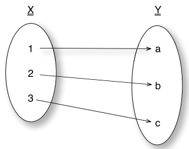

#### 1.1.2 Scala是一种函数式语言

有些读者可能对函数式编程语言并不熟悉，所以在描述它之前，我会先对函数式编程进行定义。函数式编程是一种把计算当成数学函数求值，并且避免使用状态和可变数据的编程范式。

> **可变（mutable）和不可变（immutable）数据**

> 可以通过对象的引用来改变它的内容的对象，是可变对象。不能通过对象的引用改变它的内容的对象，是不可变对象。

> 创建可变对象非常容易，你只需提供对这个对象可变状态的访问接口即可。可变对象的优点是可以追踪到状态变化。在多线程环境中，你需要使用锁/同步技术来避免并发访问引起的相关问题。而对不可变对象来说，这些问题都是不存在的。

函数式编程与数学相近，在它的世界观里，程序是由函数组成的，这些函数接受某些输入，产出对应输出（这些输入和输出也可能是函数）。函数式编程的构建单元即不是对象（OOP风格），也不是过程（procedure，C语言风格），而是函数。用函数进行编程，这是对函数式编程的一个简单定义。

理解函数的概念是非常重要的。函数即是把定义域中每个的值（input）都分别映射成值域中的某个值（output）。图1.1描述的是函数把定义域X中值，映射成值域Y中的某个值。

***图1.1 将X中值映射成Y某个值的纯函数***

> **怎样将数学中的函数与编程中的函数建立对应关系？**

> 在数学中，函数关联一组被称为定义域（在编程中被称为输入）的元素到一组被称为值域（编程中被称为输出）的元素。函数把定义域中的每个元素都精确映射到值域中的某个值。如：`f(x) = y`可以被解释为
*x与y有一个f关系，或者x通过f映射到y*。

> 如果在编写函数时脑子里时刻装着数学函数的定义，那么你写出的函数对于给定的输入总是会得到相同的输出。

> 让我们用程序进一步说明。假如你有一个函数，它包括两个输入参数，以求和做为输出。如下：

> `def addFunction(a: Int, b： Int) = a + b`

> 对于一个给定的输入`set(2, 3)`，这个函数总是返回`5`。反之，下面的这个`currentTime`函数并不适合于这个定义：

> `def currentTime(timezone: TimeZone) = Calendar.getInstance(timezone).getTime`

> 对于给定的参数timezone，它总是根据当天时间的不同，返回不总的结果。

> 数学函数的另一个有意思的特性是*引用透明*（referential transparency），这意味着一个表达式可以被它的结果替代。在`addFunction`的例子中，我们可以在所有对这个函数调用的地方用它的输出结果替代，此时，程序的表现是不会被改变的。

函数式编程的另一个方面是它没有副作用（side effect）和可变性（mutability）。没有可变性和副作用的好处是函数式风格的程序更容易理解（没有副作用），由此可知，测试会变的非常活跃高效，因为函数都是本地的，没有其它外部影响。
另一个巨大的好处是函数式编程给并发编程带来很多便利。因为对所有进程和线程来说，所有东西都是不可变的，所以并发最大的难点被解决了。在学习Scala的同时，并发编程的内容会贯穿本书，特别是第10章。

> **副作用（side effect）**

> 当一个函数或表达式除了产出一个值之外，还修改一些状态，或者与调用它的函数或外界产生可见交互，那么这个函数就是有副作用的。一个函数可能修改一个全局或静态变量、修改它的参数、抛异常、打印终端或写入文件、读取数据、或者调用其它有副作用的函数，这些行为都是有副作用的。
一个函数有副作用与否，取决于它的执行历史。

现在让我们讨论下函数式编程语言。函数式编程语言必须至少支持以下几个特性：
- 高阶函数（Higher-order funcation）（第4章）
- 闭包（Lexical closure）(第3章)
- 模式匹配（pattern matching）（第2章和第3章）
- 唯一赋值（single assignment）（第2章）
- 延迟计算（lazy evaluation）（第2章）
- 类型推断（type inference）（第2章）
- 尾部调用优化（tail call optimization）（第5章）
- List表达式（第2章和第4章）
- Mondadic effects（第5章）

如果你之前没有接触过函数式编程，你可能对上面的一些特性并不熟悉。Scala支持其中的大部分特性，简单起见，Scala是一种把函数当做头等值（first-class value）的函数式编程语言。
这意味着，在Scala中每个函数都是一个值（比如整数`1`或者字符串`"f"`）。和其它的值一样，你可以把函数作为参数传递，或者作为其它函数的返回值。

> **Scala是纯函数式语言吗？**

> 简而言之，Scala并不是纯函数式语言。在纯函数式语言的字典里，根本就没有修改这个词，变量和数学中一样，是被标识符引用的不可变的固定值。Haskell是一种纯函数式语言。

> Scala同时支持两种类型的变量：唯一赋值变量（也被称为值（value）），即在它的生命周期中不可变的变量；可变变量，即可以改变状态或分配给其它对象的变量。
> 虽然你可以在任何时候都使用不可变对象，但这并不是Scala在语言层面上硬性规定的，这只是一种惯例上的限制。一种比较好的做法是，总是默认使用val，在非用不可时，才使用可用对象。

> 对我来说，函数式语言的基本特性是把函数当作值，在这一点上，Scala上做的很好。

在Scala中，你可以把一个函数`(x: Int) => x + 1`赋值给一个val引用，并且用这个引用来触发这个函数调用：

`val inc = (x: Int) => x + 1
inc(1)`

上例中，val表示的一个唯一赋值变量（与Java中的final变量类似）。这种变量在被分配值之后，是不能够被改变的。这个函数调用的结果是`2`。

在下面的例子中，你可以观察到怎样把一个函数做为参数传递给另一个函数，并得到结果：

`List(1, 2, 3).map((x: Int) => x + 1)`

在这个例子中，我们向一个`map`函数传递了一个增量函数，`List(1, 2, 3)`对象调用 `map`函数产生的输出为`List(2, 3, 4)`。从这个输出中我们可以分析出，`map`对list中的每个元素都调用了这个增量函数。
现在不必为语法问题担心，我们将在后续章节中对此进行详细讲解。

## 链接
- [目录](../README.md)
- 下一节: [1.1.3 Scala是一种多范式语言](1.1.1.3.md)
